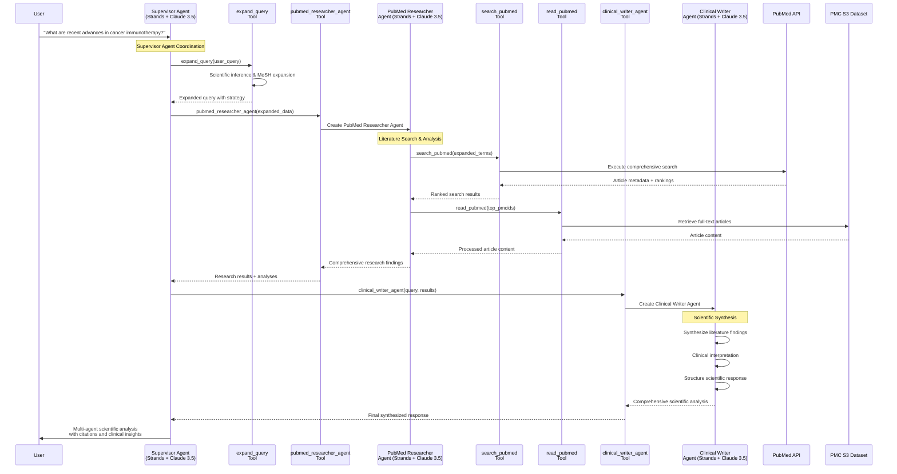
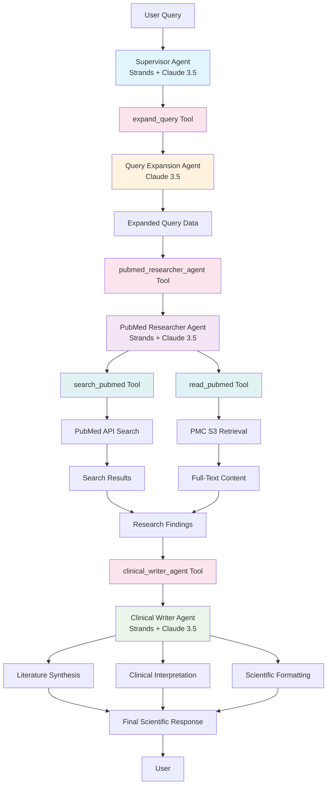

# PubMed Multi-Agent System - Simplified Deployment

## Overview

This is a **true multi-agent system** that implements three specialized AI agents working together to provide comprehensive scientific literature analysis. The system follows the "Agents as Tools" pattern from the Strands framework, adapted for direct Bedrock API usage.

## 🤖 Multi-Agent Architecture (Strands Framework)

### Agent 1: Supervisor Agent
- **Framework**: Strands Agent with Claude 3.5 Sonnet
- **Role**: Multi-agent coordination and workflow management
- **Tools**: `expand_query`, `pubmed_researcher_agent`, `clinical_writer_agent`
- **Capabilities**:
  - Analyzes user intent and scientific context
  - Coordinates the entire research workflow
  - Delegates tasks to specialized agents
  - Ensures comprehensive coverage and quality

### Agent 2: PubMed Researcher Agent  
- **Framework**: Strands Agent with Claude 3.5 Sonnet
- **Role**: Literature search and data collection specialist
- **Tools**: `search_pubmed`, `read_pubmed`
- **Capabilities**:
  - Executes comprehensive PubMed searches with citation ranking
  - Retrieves full-text articles from PMC Open Access
  - Performs detailed analysis of research papers
  - Extracts key findings and methodologies

### Agent 3: Clinical Writer Agent
- **Framework**: Strands Agent with Claude 3.5 Sonnet
- **Role**: Scientific synthesis and communication specialist
- **Tools**: Advanced reasoning and synthesis capabilities
- **Capabilities**:
  - Synthesizes findings into structured scientific format
  - Provides clinical interpretation and significance
  - Identifies research gaps and future directions
  - Formats proper citations and references

## 🔄 Multi-Agent Workflow



## 🏗️ System Architecture



## 🚀 Deployment Instructions

### Prerequisites
- AWS CLI configured with appropriate permissions
- Python 3.12 or later
- [uv](https://docs.astral.sh/uv/) package manager

### Step 1: Navigate to Project Directory
```bash
cd amazon-bedrock-agents-healthcare-lifesciences/agents_catalog/25-Pubmed-Supervisor-Agent/simplified_agent
```

### Step 2: Install Dependencies
```bash
# Install uv if not already installed
curl -LsSf https://astral.sh/uv/install.sh | sh

# Install CDK dependencies
uv add aws-cdk-lib constructs

# Install Lambda dependencies with ARM64 architecture
uv run pip install -r requirements.txt --python-version 3.12 --platform manylinux2014_aarch64 --target ./packaging/_dependencies --only-binary=:all:
```

### Step 3: Package Lambda Code
```bash
uv run python ./bin/package_for_lambda.py
```

### Step 4: Deploy Infrastructure
```bash
# Bootstrap AWS environment (if not already done)
uv run cdk bootstrap

# Deploy the Lambda function and dependencies
uv run cdk deploy
```

### Step 5: Test the Multi-Agent System
```bash
aws lambda invoke --function-name SupervisorAgentLambda \
      --cli-binary-format raw-in-base64-out \
      --cli-read-timeout 900 \
      --payload '{"prompt": "What are recent advances in cancer immunotherapy biomarkers?"}' \
      output.json --region us-east-2

# View the response
cat output.json
```

## 📊 Example Multi-Agent Interactions

### Example 1: Cancer Immunotherapy Research
**User Query**: "What are recent advances in cancer immunotherapy biomarkers?"

**Supervisor Agent Output**:
```json
{
  "expanded_terms": "cancer immunotherapy biomarkers OR checkpoint inhibitor biomarkers OR PD-1 biomarkers OR PD-L1 expression OR tumor mutational burden OR microsatellite instability OR CAR-T therapy biomarkers",
  "search_strategy": "Focus on recent clinical trials and biomarker validation studies",
  "focus_areas": ["predictive biomarkers", "resistance mechanisms", "combination therapies"],
  "temporal_filter": "last 3 years"
}
```

**PubMed Researcher Agent**: Searches 300+ articles, analyzes top 25, retrieves 4 full-text papers

**Clinical Writer Agent**: Synthesizes findings into structured scientific response with clinical implications

### Example 2: Drug Development Query
**User Query**: "GLP-1 receptor agonists cardiovascular outcomes"

**Multi-Agent Process**:
1. **Supervisor**: Expands to include "semaglutide OR liraglutide OR cardiovascular safety OR MACE outcomes"
2. **Researcher**: Finds clinical trials, meta-analyses, and safety studies
3. **Writer**: Synthesizes cardiovascular safety profile with clinical recommendations

## 🔍 Key Features

### Advanced Query Expansion
- **MeSH Term Integration**: Uses medical subject headings for comprehensive coverage
- **Scientific Synonyms**: Includes alternative terminology and abbreviations
- **Temporal Filtering**: Focuses on recent research when relevant
- **Study Type Prioritization**: Emphasizes high-quality evidence (RCTs, meta-analyses)

### Comprehensive Literature Analysis
- **Citation-Based Ranking**: Prioritizes influential papers using `referenced_by` scoring
- **Full-Text Analysis**: Retrieves and analyzes complete articles from PMC Open Access
- **Relevance Scoring**: Ranks articles based on alignment with research focus areas
- **Multi-Source Integration**: Combines abstract and full-text insights

### Scientific Communication
- **Structured Responses**: Executive summary, analysis, clinical significance, conclusions
- **Proper Citations**: Includes PMID numbers and URLs for verification
- **Clinical Interpretation**: Translates research findings into practical implications
- **Research Gap Identification**: Highlights areas needing further investigation

## 🏥 Clinical Applications

### Biomarker Research
- Identify predictive and prognostic biomarkers
- Analyze biomarker validation studies
- Compare biomarker performance across studies

### Drug Development
- Safety and efficacy analysis
- Mechanism of action research
- Clinical trial outcome synthesis

### Treatment Guidelines
- Evidence synthesis for clinical recommendations
- Comparative effectiveness research
- Treatment algorithm development

### Research Planning
- Literature gap analysis
- Research question formulation
- Study design insights

## 💡 Advantages Over Traditional Approaches

### vs. Single-Agent Systems
- **Specialized Expertise**: Each agent optimized for specific tasks
- **Better Quality**: Dedicated agents for expansion, research, and writing
- **Scalability**: Can add more specialized agents (e.g., Statistical Analyst)

### vs. Complex Bedrock Agent Deployments
- **Simplified Deployment**: Single Lambda function, no complex CloudFormation
- **Cost Effective**: No agent infrastructure costs, only Lambda execution
- **Easier Debugging**: Full visibility into multi-agent interactions
- **Flexible Customization**: Easy to modify agent behavior and prompts

### vs. Manual Literature Review
- **Comprehensive Coverage**: Systematic expansion and search strategies
- **Consistent Quality**: Standardized analysis and synthesis approach
- **Time Efficient**: Automated processing of large literature volumes
- **Bias Reduction**: Systematic methodology reduces selection bias

## 🔧 Technical Architecture

### Lambda Function Structure
```
lambda/
├── simple_supervisor_handler.py    # Main multi-agent orchestrator using Strands
├── search_pubmed.py                # PubMed search tool with @tool decorator
└── read_pubmed.py                  # PMC article retrieval tool with @tool decorator
```

### Strands Agent Framework
- **Supervisor Agent**: Coordinates workflow using `expand_query`, `pubmed_researcher_agent`, `clinical_writer_agent` tools
- **PubMed Researcher Agent**: Uses `search_pubmed` and `read_pubmed` tools for literature analysis
- **Clinical Writer Agent**: Specialized for scientific synthesis and communication
- **Query Expansion Agent**: Dedicated agent for scientific query enhancement

### Dependencies
- **strands-agents**: Strands Agent framework for multi-agent coordination
- **httpx**: HTTP client for PubMed API calls
- **boto3**: AWS SDK for Bedrock and S3 access
- **defusedxml**: Secure XML parsing for PubMed responses

### AWS Resources
- **Lambda Function**: SupervisorAgentLambda (ARM64, 1024MB, 15min timeout)
- **Lambda Layer**: Dependencies layer with proper `python/` structure
- **IAM Permissions**: Bedrock model access + S3 read access to PMC dataset

## 🎯 Performance Characteristics

### Response Times
- **Simple Queries**: 30-60 seconds
- **Complex Research**: 2-5 minutes
- **Comprehensive Analysis**: 5-10 minutes

### Resource Usage
- **Memory**: 1024MB (sufficient for multi-agent coordination)
- **Timeout**: 15 minutes (accommodates comprehensive research)
- **Concurrency**: Supports multiple simultaneous requests

### Cost Optimization
- **ARM64 Architecture**: ~20% cost reduction vs x86_64
- **Efficient Caching**: Reuses Bedrock client and connections
- **Smart Filtering**: Focuses on high-quality, relevant articles

## 🔮 Future Enhancements

### Additional Specialized Agents
- **Statistical Analyst Agent**: Meta-analysis and statistical synthesis
- **Clinical Guidelines Agent**: Integration with treatment recommendations
- **Regulatory Agent**: FDA/EMA approval status and regulatory insights
- **Economic Analyst Agent**: Cost-effectiveness and health economics

### Enhanced Capabilities
- **Multi-Language Support**: International literature inclusion
- **Real-Time Updates**: Continuous literature monitoring
- **Personalized Profiles**: User-specific research preferences
- **Collaborative Features**: Multi-user research projects

## 📚 References and Citations

The system automatically generates proper citations in the format:
- **PMID**: Direct links to PubMed articles
- **PMC**: Links to full-text articles when available
- **DOI**: Digital object identifiers for permanent access

## 🆘 Troubleshooting

### Common Issues
1. **Timeout Errors**: Reduce `max_results` or `max_records` parameters
2. **Memory Issues**: Increase Lambda memory allocation
3. **API Rate Limits**: Implement exponential backoff (already included)
4. **Model Access**: Ensure Bedrock model permissions are configured

### Debug Mode
Enable detailed logging by setting Lambda environment variable:
```bash
LOG_LEVEL=DEBUG
```

## 📞 Support

For issues related to:
- **AWS Infrastructure**: Check CloudFormation stack status
- **PubMed API**: Verify network connectivity and rate limits  
- **Bedrock Models**: Confirm model access and quotas
- **Multi-Agent Logic**: Review Lambda function logs

This multi-agent system provides a sophisticated, scalable approach to scientific literature analysis that combines the power of specialized AI agents with comprehensive biomedical data sources.
